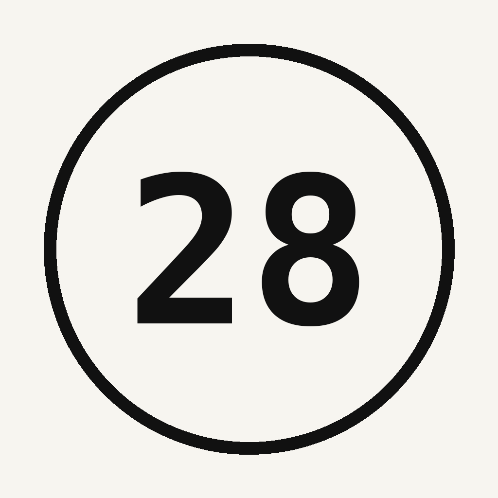

<div align="center">
  
  <h1>28 Days App</h1>
  <a href="https://28days-app.netlify.app">Web</a>
</div>

Aplicación web para el seguimiento de buenos hábitos en 4 semanas (28 días).

## Funciones

- **Reto de 28 días**: seguimiento de un ciclo de 4 semanas con días `1/28` y fecha de fin calculada automáticamente.
- **Vista Hoy**: anillo de progreso del día actual, checklist de hábitos del día y botón para marcar/cerrar el día completo.
- **Gestión de hábitos**: crear, editar y eliminar hábitos con frecuencia diaria o en días específicos de la semana (L–D).
- **Vista Hábitos**: tarjetas por hábito con objetivo semanal y barra de progreso, además de un resumen global semanal.
- **Vista Reto**: heatmap completo de 4 semanas × 7 días con intensidad por día, tasa de efectividad, racha actual y días restantes.
- **Perfil**: nombre/alias editable, iniciales en avatar y rango de fechas del reto.
- **Sincronización automática**: al volver, el día se recalcula según la fecha de inicio; se respetan los días no registrados.
- **Ajustes**: reinicio total del reto (vuelve al Día 1).
- **Persistencia local**: todos los datos se guardan en `localStorage` del navegador, sin backend.
- **PWA ligera**: manifest incluido para instalarla como app en el móvil.

## Tecnologías

- HTML5, CSS3 y JavaScript puro (vanilla, sin frameworks).
- [Tailwind CSS](https://tailwindcss.com) vía CDN con configuración de tema y paleta personalizada.
- Google Fonts: Plus Jakarta Sans y JetBrains Mono.
- `localStorage` para persistencia de datos.
- Manifest PWA (`manifest.json`) con icono propio.


## Uso local

La aplicación es 100% estática, así que basta con servir el directorio raíz:

```bash
python3 -m http.server 8000
```

Abrir `http://localhost:8000`.

## Despliegue

Conecta el repositorio a Netlify. No requiere build; se publica el directorio raíz tal cual.